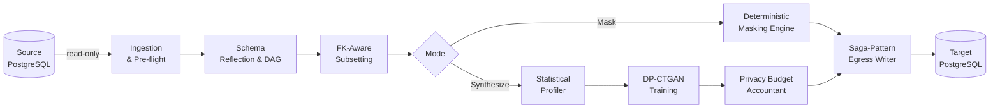
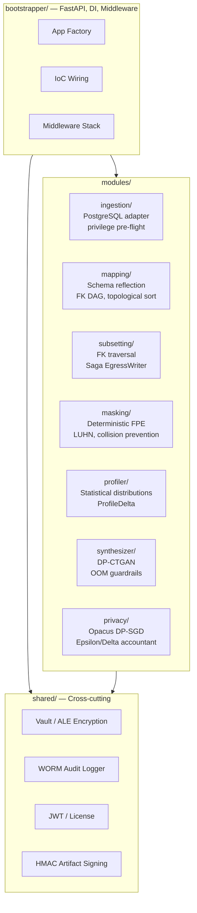
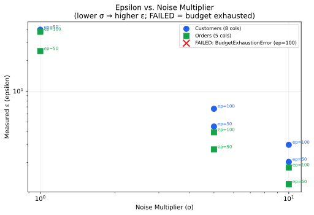
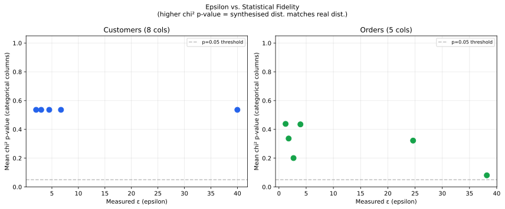

# Conclave

**An enterprise-grade, air-gapped synthetic data generation engine.**

Conclave transforms production databases into privacy-safe synthetic replicas — inside your perimeter, on your hardware, with zero network calls out. For data scientists who need statistically faithful training data, QA engineers who need a structurally intact production subset, and compliance officers who need mathematical proof that no real PII left the building.

---

## The Problem

Production data accurately reflects real user behavior. It is also the data you cannot freely share.

- **Regulation** (GDPR, CCPA, HIPAA) prohibits moving raw PII into development, QA, or ML training — even internally.
- **Basic masking breaks referential integrity.** Swap a customer name in one table; the FK join to orders returns garbage.
- **SaaS data platforms require your data to leave your network** — disqualified in defense, intelligence, healthcare, and critical infrastructure.
- **Air-gapped deployments need a fully self-contained stack.** No license call-home, no model registry pull, no telemetry ping.

---

## How It Works



- **Ingestion & Pre-flight** — Read-only connection to source PostgreSQL. Privilege pre-flight check: write access → immediate rejection before any data is touched.
- **Schema Reflection & DAG** — Reflects the full schema; builds a FK directed acyclic graph via Kahn's topological sort. Virtual FK support for schemas without formal constraints.
- **FK-Aware Subsetting** — Traverses the FK graph from a seed query; extracts a precise percentage of records. Zero orphan rows guaranteed.
- **Deterministic Masking** — HMAC-SHA256 seeded Faker replaces PII with realistic-but-fake values. Same real value → same fake value across all tables. Join integrity preserved; not reversible.
- **Statistical Profiling** — Computes histograms, covariance matrices, and nullability rates per column. `ProfileDelta` measures drift between source and synthetic output.
- **DP-CTGAN Training** — Custom CTGAN loop with Opacus DP-SGD on the `OpacusCompatibleDiscriminator` (ADR-0036). Epsilon accounting reflects actual Discriminator gradient steps. Generator trains without DP (it never sees real data directly — standard DP-GAN threat model). Proxy-model fallback available; see ADR-0025.
- **Privacy Budget Accounting** — `spend_budget()`/`reset_budget()` tracks epsilon/delta per table per run. Jobs exceeding budget are blocked before training starts.
- **Saga-Pattern Egress** — Transactional writes to target. Failure mid-write → target wiped clean. No partial datasets.

---

## Architecture

Conclave is a **Python Modular Monolith** — one deployable unit with strict module boundaries enforced by `import-linter` at CI time.



- Modules cannot import from each other — only through `shared/` value objects or IoC callbacks injected by the bootstrapper.
- Cross-module database queries are forbidden. Each module owns its own data access.
- The bootstrapper is the sole composition root. Business logic has no framework knowledge.

54 ADRs in [`docs/adr/`](docs/adr/). Full specification in [`docs/archive/ARCHITECTURAL_REQUIREMENTS.md`](docs/archive/ARCHITECTURAL_REQUIREMENTS.md).

---

## Security

Security is Priority Zero. See [`CONSTITUTION.md`](CONSTITUTION.md) and [`docs/infrastructure_security.md`](docs/infrastructure_security.md).

| Control | Implementation |
|---------|----------------|
| Read-only ingestion | Pre-flight privilege check; superuser → immediate reject |
| PII never in plaintext at rest | ALE via Fernet + HKDF-SHA256 from Vault KEK |
| Vault unseal | Operator passphrase derives KEK at runtime; never persisted |
| Deterministic masking | HMAC-SHA256 seeded Faker; same input → same output; not reversible |
| Differential Privacy | DP-SGD via Opacus on CTGAN Discriminator; Epsilon/Delta budget enforced per run |
| WORM audit log | Cryptographically signed, append-only |
| HMAC artifact signing | Signed at save; tampering raises `SecurityError` at load |
| Air-gap enforcement | No external network calls; `make build-airgap-bundle` for sneaker-net |
| Supply chain | All GitHub Actions SHA-pinned; Trivy container scan in CI |
| Secret scanning | `gitleaks` + `detect-secrets` on every commit; hooks cannot be bypassed |
| Request body limits | `RequestBodyLimitMiddleware`: 1 MB, JSON depth 100 |
| Content Security Policy | `script-src`, `font-src`, `connect-src` all `'self'` |
| OWASP ZAP baseline | Automated ZAP scan in CI against the running FastAPI app |
| NIST SP 800-88 erasure | Cryptographic shredding per NIST SP 800-88 Rev 1 |
| Offline license | RS256 JWT with hardware binding; no call-home |
| Config validation | `validate_config()` at boot; missing required vars → immediate exit |

### DP Maturity

**Current**: Discriminator-level DP-SGD (Phase 30). Proxy-model fallback available.

Production epsilon results from the 1M-row load test (2026-03-20, CPU-only, macOS ARM64):

| Table | Source Rows | noise_multiplier (σ) | actual_epsilon | Privacy Level |
|-------|------------|----------------------|----------------|--------------|
| customers | 50,000 | 1.1 | 9.891 | Moderate |
| orders | 175,000 | 5.0 | 0.685 | Strong |
| order_items | 611,540 | 10.0 | 0.169 | Excellent |
| payments | 175,000 | N/A | N/A | No DP (enable_dp=False) |

Micro-benchmark (`scripts/benchmark_dp_quality.py`, run 2026-03-21) PASSED at all five noise levels. See [docs/archive/DP_QUALITY_REPORT.md](docs/archive/DP_QUALITY_REPORT.md).

| Aspect | Phase 30 (Discriminator-level) | Proxy-model Fallback |
|--------|-------------------------------|---------------------|
| DP scope | Direct DP-SGD on `OpacusCompatibleDiscriminator` | Proxy linear model on same preprocessed data |
| Epsilon | End-to-end on real Discriminator gradient steps | Proportional to dataset/batch/steps; doesn't account for Discriminator updates |
| Guarantee | Mathematically rigorous end-to-end DP | Practical approximation |
| Reference | ADR-0036 | ADR-0025 |

The masking pipeline, privacy budget accountant, HMAC-sealed artifacts, and WORM audit log are independent of this distinction.

---

## Compliance

| Property | Mechanism |
|----------|-----------|
| Data minimization | Read-only ingestion; PII never written to disk in raw form |
| Storage limitation | Configurable TTLs: job records (90 days), artifacts (30 days) |
| Audit trail | WORM log retained 3 years (1,095 days); never deleted within retention |
| Right to erasure (GDPR Art. 17 / CCPA § 1798.105) | `DELETE /compliance/erasure` with cascade deletion and compliance receipt |
| Legal hold | `legal_hold` flag prevents purge regardless of TTL |
| Formal privacy guarantee | (ε, δ)-DP on synthesized output — not PII under GDPR Recital 26 |

Configurable via `JOB_RETENTION_DAYS`, `AUDIT_RETENTION_DAYS`, `ARTIFACT_RETENTION_DAYS`. See [`docs/DATA_COMPLIANCE.md`](docs/DATA_COMPLIANCE.md).

---

## The Interface

React SPA with real-time job monitoring via SSE. All components meet WCAG 2.1 AA: labeled forms, semantic headings, full keyboard navigation, 4.5:1 contrast ratios.

**Vault unseal** — operator enters a passphrase to derive the ALE key at runtime. Never stored.


**Dashboard — sealed.** All data operations refused until vault is unsealed.


**Dashboard — ready.** Job creation and monitoring; SSE streams progress in real time.


**Dashboard — active jobs.** Training (blue), completed (green), failed (red).


**Error handling.** Failures surface immediately — including OOM pre-flight rejections before training begins.


---

## Getting Started

### Prerequisites

- Docker and Docker Compose (v2.20+)
- Python 3.14 and [Poetry](https://python-poetry.org/)
- Node.js (for the React SPA)

### 1. Clone and install

```bash
git clone <repo-url> && cd conclave
poetry install --with dev,integration,synthesizer
```

### 2. Start local services

```bash
docker compose up -d
# Starts PostgreSQL, Redis, minio-ephemeral, pgbouncer, Prometheus, Alertmanager, Grafana
```

### 3. Apply migrations and configure

```bash
cp .env.example .env
# Edit .env — set DB credentials, ARTIFACT_SIGNING_KEY, etc.

export DB_USER=conclave DB_PASSWORD=postgres DB_HOST=localhost DB_PORT=5432 DB_NAME=conclave
poetry run alembic upgrade head
```

### 4. Run the backend

```bash
poetry run uvicorn synth_engine.bootstrapper.main:create_app --factory --reload
# API at http://localhost:8000
```

### 5. Run the frontend

```bash
cd frontend && npm ci && npm run dev
# SPA at http://localhost:5173 — proxies API calls to :8000
```

### Air-gap bundle

```bash
make build-airgap-bundle
# Versioned tarball: Python wheels, Docker images, config for sneaker-net deployment
```

Full production deployment in the [Operator Manual](docs/OPERATOR_MANUAL.md).

---

## Masking Evidence

Live run against real Docker infrastructure. Not a mock.

Source (real PII):

```
 id | first_name | last_name |          email           |     ssn
----+------------+-----------+--------------------------+-------------
  1 | Danielle   | Johnson   | john21@example.net       | 759-70-1425
  2 | Lindsay    | Blair     | dudleynicholas@example.net | 301-81-5926
```

Target (masked):

```
 id | first_name |  last_name  |            email             |     ssn
----+------------+-------------+------------------------------+-------------
  1 | Jeffrey    | Beck        | garciabrittany@example.org   | 536-35-6662
  2 | David      | Owens       | lauradavis@example.com       | 204-28-8133
```

Every PII column replaced. `Johnson` always maps to `Beck` — across every row, every table, every run — so join integrity holds. Not reversible.

FK traversal: 50 customers → 116 orders → 396 order items + 116 payments. Zero orphan rows. See [full E2E validation](docs/archive/E2E_VALIDATION.md).

---

## Validated Scale

1M-row load test (2026-03-20, CPU-only, macOS ARM64, 10 cores, 24 GB RAM).

| Table | Source Rows | Synth Rows | Training Time | Throughput |
|-------|------------|------------|---------------|------------|
| customers | 50,000 | 50,000 | 13 min | 64 rows/s |
| orders | 175,000 | 175,000 | 42 min | 69 rows/s |
| order_items | 611,540 | 200,000 | 2 h 25 min | 23 rows/s |
| payments | 175,000 | 175,000 | 1 h 5 min | 45 rows/s |
| **Total** | **1,011,540** | **600,000** | **~4 h 12 min** | — |

CPU-only baseline. GPU will be substantially faster — the discriminator-level DP-SGD loop is GPU-bound once CTGAN's embedding completes.

Full evidence in [docs/archive/E2E_VALIDATION.md](docs/archive/E2E_VALIDATION.md).

---

## Demos & Benchmarks

Three runnable Jupyter notebooks with real, reproducible benchmark results against the
`sample_data/` fixtures. All epsilon values are post-hoc measured by the Opacus RDP
accountant — not configured targets. Results that look bad stay in.

| Notebook | Audience | Expected Runtime | What It Shows |
|----------|----------|-----------------|---------------|
| [demos/epsilon_curves.ipynb](demos/epsilon_curves.ipynb) | Privacy engineers, reviewers | 45–90 min (CPU) | Parameterized epsilon curves across 45 noise-multiplier/epoch/sample-size combinations; KS statistics, correlation preservation, FK integrity |
| [demos/quickstart.ipynb](demos/quickstart.ipynb) | Data architects | 2–5 min (CPU) | Three-cell demo: connect → synthesize → compare. Distribution overlays, correlation heatmaps |
| [demos/training_data.ipynb](demos/training_data.ipynb) | AI/ML builders | 10–20 min (CPU) | Train on synthetic, test on real. Utility curve showing privacy-utility tradeoff by epsilon level |

**Key figures** (pre-rendered; regenerate with `poetry run python demos/generate_figures.py`):

Epsilon vs. noise multiplier — how privacy cost changes with the DP noise level:



Privacy-utility frontier — epsilon vs. statistical fidelity (KS statistic):



**Methodology**: The benchmark harness trains CTGAN at configurable noise multipliers,
epoch counts, and sample sizes. Epsilon is measured after training by the Opacus RDP
accountant using delta = 1e-5 (matching the production constant). All runs use fixed
random seeds (torch, numpy, Python) for reproducibility. GPU acceleration is detected
at runtime but CPU-only is the fully supported path.

Full setup instructions (Docker Compose, demo dependency group, seeding): [demos/README.md](demos/README.md).

---

## Quality and Development Process

Every commit passes all gates before merge:

```bash
poetry run ruff check src/ tests/
poetry run ruff format --check src/ tests/
poetry run mypy src/
poetry run bandit -c pyproject.toml -r src/
poetry run pytest tests/unit/ --cov=src/synth_engine --cov-fail-under=95 -W error
poetry run pytest tests/integration/ -v
poetry run python -m importlinter
pre-commit run --all-files
```

95% coverage enforced. Integration tests are a separate gate — unit mocks do not substitute for real infrastructure (pytest-postgresql).

Development follows attack-first TDD (Red → Green → Refactor). Every task reviewed in parallel by QA, DevOps, and Red-Team (always); Architecture (source changes); UI/UX (frontend). Findings tracked as open advisories in the retrospective log. Full workflow in [`CLAUDE.md`](CLAUDE.md), governed by [`CONSTITUTION.md`](CONSTITUTION.md).

---

## How This Was Built

A human author wrote the governance documents ([`CONSTITUTION.md`](CONSTITUTION.md), [`CLAUDE.md`](CLAUDE.md), backlog tasks, architecture specifications). AI agents executed every development task: writing failing tests first, implementing minimal passing code, running all quality gates, and submitting for multi-agent review before merge. No code was written outside this process.

**Timeline**: March 9–23, 2026 — 14 calendar days from first commit to Phase 52.

| Metric | Value |
|--------|-------|
| Commits | 1,080 |
| Pull requests merged | 191 |
| Architecture Decision Records | 54 |
| Production source lines | ~23,100 |
| Test lines | ~86,500 |
| Test coverage | 96.76% |

Full account in [`docs/archive/DEVELOPMENT_STORY.md`](docs/archive/DEVELOPMENT_STORY.md).

---

## Documentation

| Document | Contents |
|----------|----------|
| [Operator Manual](docs/OPERATOR_MANUAL.md) | Production deployment, hardware requirements, service configuration |
| [Data Compliance](docs/DATA_COMPLIANCE.md) | Retention policy, GDPR/CCPA/HIPAA guidance, erasure procedure, audit trail |
| [DP Quality Report](docs/archive/DP_QUALITY_REPORT.md) | Micro-benchmark results; epsilon vs. quality curves; recommended ranges by use case |
| [E2E Validation](docs/archive/E2E_VALIDATION.md) | Full end-to-end pipeline validation evidence |
| [Disaster Recovery](docs/DISASTER_RECOVERY.md) | Incident response and recovery procedures |
| [Licensing](docs/LICENSING.md) | Offline license activation and hardware binding |
| [Infrastructure Security](docs/infrastructure_security.md) | Security controls and threat model |
| [Dependency Audit](docs/DEPENDENCY_AUDIT.md) | Supply chain audit and dependency provenance |
| [Business Requirements](docs/archive/BUSINESS_REQUIREMENTS.md) | Full product BRD (archived) |
| [Architectural Requirements](docs/archive/ARCHITECTURAL_REQUIREMENTS.md) | Architecture specification (archived; see ADRs) |
| [Architecture Decision Records](docs/adr/) | 54 ADRs covering every significant design decision |
| [Retrospective Log](docs/RETRO_LOG.md) | Review findings, open advisories, development history |
| [Development Story](docs/archive/DEVELOPMENT_STORY.md) | How this codebase was built (archived) |
| [Constitution](CONSTITUTION.md) | Binding governance framework; security is Priority Zero |
| [Changelog](CHANGELOG.md) | Phase-by-phase release notes, Phase 1–52 |
| [API Reference](docs/api/API_REFERENCE.md) | REST API endpoint reference (static OpenAPI export) |
| [Demo Suite](demos/README.md) | Jupyter notebooks and benchmark scripts |

---

## License

This project is licensed under the [GNU Affero General Public License v3.0](LICENSE).
