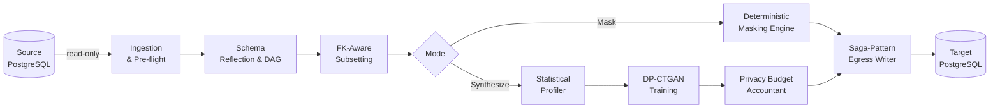
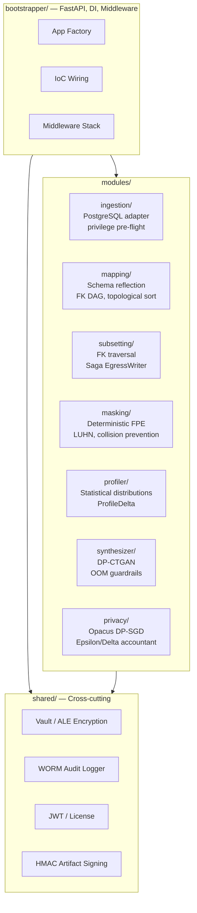
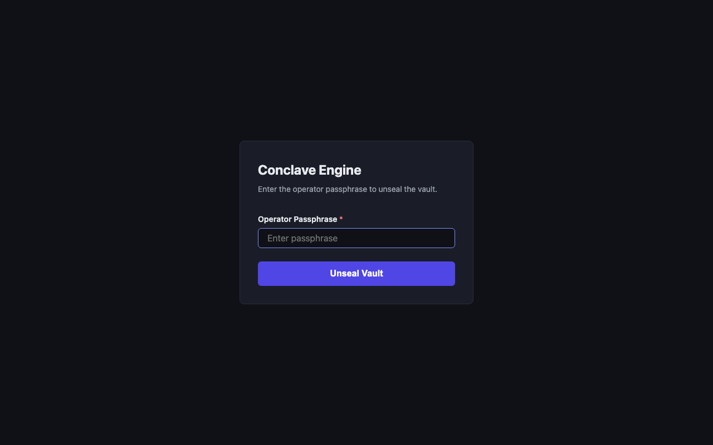
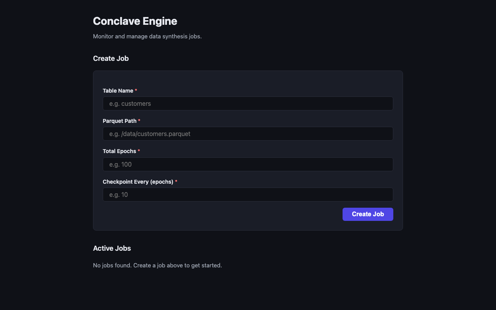
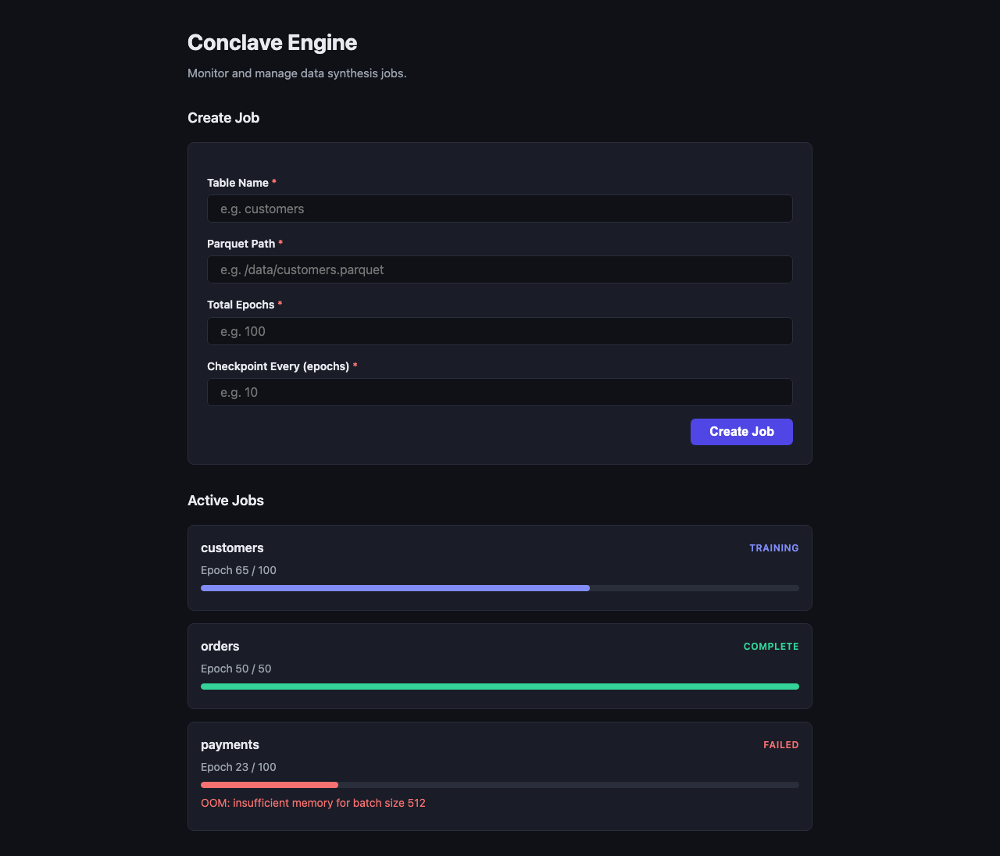
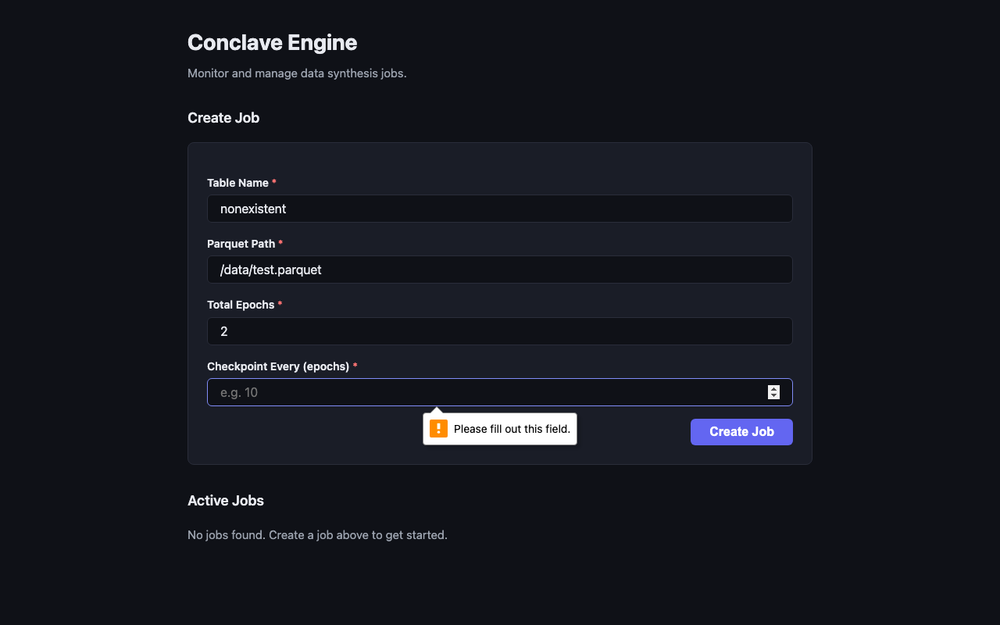

# Conclave

**An enterprise-grade, air-gapped synthetic data generation engine.**

Conclave transforms production databases into privacy-safe synthetic replicas — inside your
perimeter, on your hardware, with zero network calls out. It serves data scientists who
need statistically faithful training data, QA engineers who need a structurally intact
subset of a production schema, and compliance officers who need mathematical proof that
no real PII left the building.

---

## The Problem

Production data is the only data that accurately reflects real user behavior. It is also the
data you cannot freely share.

- **Regulation** (GDPR, CCPA, HIPAA) prohibits moving raw PII into development, QA, or ML
  training environments — even internally.
- **Basic masking breaks referential integrity.** Swap a customer name in one table; the
  foreign-key join to the orders table returns garbage. Tests fail. Models learn noise.
- **SaaS data platforms require your data to leave your network.** That is categorically
  disqualified in defense, intelligence, healthcare, and critical infrastructure.
- **Air-gapped deployments need an entirely self-contained stack.** No license call-home,
  no model registry cloud pull, no telemetry ping.

Conclave solves all four. It runs entirely on your compute, ingests data read-only, and
produces output that is statistically comparable to production but contains no real PII.

---

## How It Works



**Ingestion & Pre-flight** — Connects read-only to source PostgreSQL. Runs a privilege
pre-flight check; if the account can write, the job is refused before any data is touched.

**Schema Reflection & DAG** — Reflects the full schema, builds a directed acyclic graph of
foreign key relationships using Kahn's topological sort. Virtual FK support for schemas
without formal constraints.

**FK-Aware Subsetting** — Traverses the FK graph from a seed query, following parent-child
chains to extract a surgically precise percentage of records. Zero orphan rows guaranteed.

**Deterministic Masking** — HMAC-SHA256 seeded Faker replaces PII with realistic-but-fake
values. The same real value always produces the same fake value across all tables, so
join integrity is preserved. Output is not reversible.

**Statistical Profiling** — Computes histograms, covariance matrices, and nullability rates
per column. `ProfileDelta` measures drift between source and synthetic output.

**DP-CTGAN Training** — Custom CTGAN training loop with Opacus DP-SGD integration. Phase 30
applies DP-SGD directly to the `OpacusCompatibleDiscriminator` (ADR-0036), making epsilon
accounting reflect actual Discriminator gradient steps — not a proxy model. The Generator is
trained without DP (it never sees real data directly), following the standard DP-GAN threat
model. Proxy-model fallback (`_activate_opacus_proxy`) is available for environments where
Opacus cannot instrument the Discriminator. See ADR-0036 for discriminator-level DP rationale
and ADR-0025 for the historical proxy-model approach.

**Privacy Budget Accounting** — `EpsilonAccountant` tracks epsilon/delta consumption per
table per run. Any job that would exceed the configured budget is blocked before training starts.

**Saga-Pattern Egress** — Writes to the target database transactionally. If anything fails
mid-write, the target is wiped clean. No partial datasets.

---

## Architecture

Conclave is a **Python Modular Monolith** — a single deployable unit with strict internal
module boundaries enforced by `import-linter` contracts at CI time.



**Key design decisions:**

- Modules cannot import from each other. Cross-module communication goes through `shared/`
  value objects or IoC callbacks injected by the bootstrapper. This is enforced at CI time,
  not just by convention.
- Cross-module database queries are forbidden. Each module owns its own data access.
- The bootstrapper is the sole composition root. Business logic has no knowledge of the
  framework.

Detailed rationale is captured across 36 Architecture Decision Records in
[`docs/adr/`](docs/adr/). The full architecture specification is in
[`docs/ARCHITECTURAL_REQUIREMENTS.md`](docs/ARCHITECTURAL_REQUIREMENTS.md).

---

## Security

Security is Priority Zero — it overrides every other consideration. See
[`CONSTITUTION.md`](CONSTITUTION.md) for the binding governance framework and
[`docs/infrastructure_security.md`](docs/infrastructure_security.md) for infrastructure detail.

| Control | Implementation |
|---------|----------------|
| Read-only ingestion | Pre-flight `SELECT FOR UPDATE` privilege check; superuser account → immediate reject |
| PII never in plaintext at rest | Application-Level Encryption (ALE) via Fernet + HKDF-SHA256 derived from Vault KEK |
| Vault unseal pattern | Operator passphrase derives KEK at runtime; never persisted to disk or env |
| Deterministic masking | HMAC-SHA256 seeded Faker; same input → same output; not reversible |
| Differential Privacy | DP-SGD via Opacus `PrivacyEngine` on the CTGAN Discriminator (Phase 30); Epsilon/Delta budget enforced per training run; proxy-model fallback available — see DP Maturity below |
| WORM audit log | Cryptographically signed, append-only audit trail |
| HMAC artifact signing | Model artifacts signed at save; tampering raises `SecurityError` at load time |
| Air-gap enforcement | No external network calls; `make build-airgap-bundle` for sneaker-net deployment |
| Supply chain | All GitHub Actions SHA-pinned; Trivy container scan in CI |
| Secret scanning | `gitleaks` + `detect-secrets` on every commit; hooks cannot be bypassed |
| Request body limits | `RequestBodyLimitMiddleware`: 1 MB limit, JSON depth 100 |
| Content Security Policy | CSP middleware: `script-src`, `font-src`, `connect-src` all `'self'` |
| OWASP ZAP baseline scan | Automated ZAP scan in CI against the running FastAPI app |
| NIST SP 800-88 erasure | Cryptographic shredding validated against NIST SP 800-88 Rev 1 guidelines |
| Offline license activation | RS256 JWT with hardware binding; no license server call-home required |
| Startup config validation | `validate_config()` at boot; missing required env vars → immediate process exit |

### DP Maturity

**Current**: Discriminator-level DP-SGD (Phase 30). Proxy-model fallback available for
environments where Opacus cannot instrument the Discriminator.

> **Benchmarks Pending** — The Phase 30 discriminator-level DP-SGD quality benchmark has not
> yet been executed against the production training path. Historical proxy-model benchmark
> results are available in [docs/DP_QUALITY_REPORT.md](docs/DP_QUALITY_REPORT.md). Run
> `poetry run python3 scripts/benchmark_dp_quality.py` to generate live discriminator-level
> results.

| Aspect | Phase 30 Implementation | Proxy-model Fallback |
|--------|------------------------|---------------------|
| DP accounting scope | Direct DP-SGD on `OpacusCompatibleDiscriminator` — real Discriminator gradient steps | Proxy linear model trained on the same preprocessed data as the CTGAN |
| Epsilon measurement | End-to-end epsilon accounting on the generative model itself; reflects actual Discriminator updates on real training data | Opacus gradient-step accounting on proxy model; proportional to dataset size, batch size, and training steps |
| Privacy guarantee | Mathematically rigorous end-to-end differential privacy (standard DP-GAN threat model; Generator does not directly see real data) | Practical approximation — meaningful epsilon bound, but does not account for Discriminator gradient updates |
| Reference | ADR-0036 — Discriminator-Level DP-SGD Architecture | ADR-0025 — Custom CTGAN Training Loop (proxy-model rationale and limitations) |

The masking pipeline, `EpsilonAccountant`, HMAC-sealed model artifacts, and the WORM audit log
are not affected by this distinction — they provide independent, fully realized security controls.

---

## The Interface

The React SPA provides real-time monitoring of synthesis jobs via Server-Sent Events.
All UI components meet WCAG 2.1 AA: labeled forms, required field indicators, semantic
headings, full keyboard navigation, 4.5:1 contrast ratios.

**Vault unseal** — before any data operations, the operator enters a passphrase to derive
the ALE key at runtime. The passphrase is never stored.



**Dashboard — sealed state.** The engine refuses all data operations until the vault is unsealed.



**Dashboard — ready.** Job creation and monitoring. SSE streams progress in real time.


**Dashboard — active jobs.** Training progress (blue), completed (green), failed with
error message (red).



**Error handling.** Failures surface immediately with actionable messages — including OOM
pre-flight rejections before any training begins.



---

## Getting Started

### Prerequisites

- Docker and Docker Compose (v2.20+)
- Python 3.14 and [Poetry](https://python-poetry.org/)
- Node.js (for the React SPA)

### 1. Clone and install

```bash
git clone <repo-url> && cd conclave
poetry install --with dev,integration,synthesizer
```

### 2. Start local services

```bash
docker compose up -d
# Starts PostgreSQL, Redis, MinIO, pgbouncer, Jaeger, Grafana
```

### 3. Apply migrations and configure

```bash
cp .env.example .env
# Edit .env — set DB credentials, ARTIFACT_SIGNING_KEY, etc.

export DB_USER=conclave DB_PASSWORD=postgres DB_HOST=localhost DB_PORT=5432 DB_NAME=conclave
poetry run alembic upgrade head
```

### 4. Run the backend

```bash
poetry run uvicorn synth_engine.bootstrapper.app:create_app --factory --reload
# API available at http://localhost:8000
```

### 5. Run the frontend

```bash
cd frontend && npm ci && npm run dev
# SPA available at http://localhost:5173 — proxies API calls to :8000
```

### Air-gap bundle (for offline deployment)

```bash
make build-airgap-bundle
```

Produces a versioned tarball containing all Python wheels, Docker images, and
configuration for sneaker-net deployment onto an isolated network.

Full production deployment instructions are in the
[Operator Manual](docs/OPERATOR_MANUAL.md).

---

## Masking Evidence

This is a live run against real Docker infrastructure. Not a mock.

Source (real PII):

```
 id | first_name | last_name |          email           |     ssn
----+------------+-----------+--------------------------+-------------
  1 | Danielle   | Johnson   | john21@example.net       | 759-70-1425
  2 | Lindsay    | Blair     | dudleynicholas@example.net | 301-81-5926
```

Target (masked):

```
 id | first_name |  last_name  |            email             |     ssn
----+------------+-------------+------------------------------+-------------
  1 | Jeffrey    | Beck        | garciabrittany@example.org   | 536-35-6662
  2 | David      | Owens       | lauradavis@example.com       | 204-28-8133
```

Every PII column replaced. `Johnson` always maps to `Beck` — across every row,
every table, every run — so join integrity holds. The mapping is not reversible.

FK traversal from this run: 50 customers → 116 orders → 396 order items + 116 payments.
Zero orphan rows. See [full E2E validation evidence](docs/E2E_VALIDATION.md).

---

## Quality and Development Process

Every commit passes all gates before it can merge:

```bash
poetry run ruff check src/ tests/              # linting
poetry run ruff format --check src/ tests/     # formatting
poetry run mypy src/                           # strict type checking
poetry run bandit -c pyproject.toml -r src/    # security scan
poetry run pytest tests/unit/ \
    --cov=src/synth_engine --cov-fail-under=95 \
    -W error                                   # unit tests, 95% coverage gate
poetry run pytest tests/integration/ -v        # integration tests (separate gate)
poetry run python -m importlinter              # module boundary enforcement
pre-commit run --all-files                     # all hooks including gitleaks
```

Coverage is enforced at 95% minimum. Integration tests are a separate gate — unit test
mocks do not substitute for tests against real infrastructure (pytest-postgresql).

The development workflow is TDD (Red → Green → Refactor) enforced by convention and
by the review process. Every task is reviewed in parallel by four specialized agents:
QA, DevOps, Architecture, and UI/UX — before any merge. Review findings are tracked
as open advisories in a living retrospective log. The full workflow is documented in
[`CLAUDE.md`](CLAUDE.md) and governed by [`CONSTITUTION.md`](CONSTITUTION.md).

---

## How This Was Built

Conclave was written by AI agents operating under a Constitutional governance framework.
A human author wrote the governance documents ([`CONSTITUTION.md`](CONSTITUTION.md),
[`CLAUDE.md`](CLAUDE.md), backlog tasks, and architecture specifications), then AI agents
executed every development task: writing failing tests first, implementing the minimal code
to pass them, running all quality gates, and submitting work for multi-agent review before
merge. No code was written outside this process.

**Timeline**: March 9–18, 2026 — 9 calendar days from first commit to Phase 32.

**By the numbers** (at Phase 32 completion, commit `3fa02cd`; verifiable from `git log`):

| Metric | Value |
|--------|-------|
| Commits | 523 |
| Pull requests merged | 127 |
| Architecture Decision Records | 36 |
| Production source lines | ~15,500 |
| Test lines | ~45,700 |
| Reported test coverage | 98% integration |

Every architectural decision was documented in an ADR before implementation. Every
non-trivial design choice — library selection, DP threat model, module boundary exceptions —
required written rationale. The retrospective log records every review finding and advisory
raised across all 32 phases.

The full account of how this project was structured, what worked, and what the process
looked like in practice is in [`docs/DEVELOPMENT_STORY.md`](docs/DEVELOPMENT_STORY.md).

---

## Documentation

| Document | Contents |
|----------|----------|
| [Operator Manual](docs/OPERATOR_MANUAL.md) | Production deployment, hardware requirements, service configuration |
| [DP Quality Report](docs/DP_QUALITY_REPORT.md) | Epsilon vs. quality degradation curves; recommended epsilon ranges by use case |
| [E2E Validation](docs/E2E_VALIDATION.md) | Full end-to-end pipeline validation evidence |
| [Disaster Recovery](docs/DISASTER_RECOVERY.md) | Incident response and recovery procedures |
| [Licensing](docs/LICENSING.md) | Offline license activation and hardware binding guide |
| [Infrastructure Security](docs/infrastructure_security.md) | Infrastructure security controls and threat model |
| [Dependency Audit](docs/DEPENDENCY_AUDIT.md) | Supply chain audit and dependency provenance |
| [Business Requirements](docs/BUSINESS_REQUIREMENTS.md) | Full product BRD — the "why" behind every capability |
| [Architectural Requirements](docs/ARCHITECTURAL_REQUIREMENTS.md) | Architecture specification and module boundary contracts |
| [Architecture Decision Records](docs/adr/) | 36 ADRs covering every significant design decision |
| [Retrospective Log](docs/RETRO_LOG.md) | Review findings, open advisories, and development history |
| [Development Story](docs/DEVELOPMENT_STORY.md) | How this codebase was built — methodology, process, and retrospective |
| [Constitution](CONSTITUTION.md) | Binding governance framework; security is Priority Zero |
| [Changelog](CHANGELOG.md) | Phase-by-phase release notes from Phase 1 through Phase 32 |
| [API Reference](docs/api/API_REFERENCE.md) | REST API endpoint reference (static export from OpenAPI schema) |

---

## License

Proprietary. All rights reserved.
