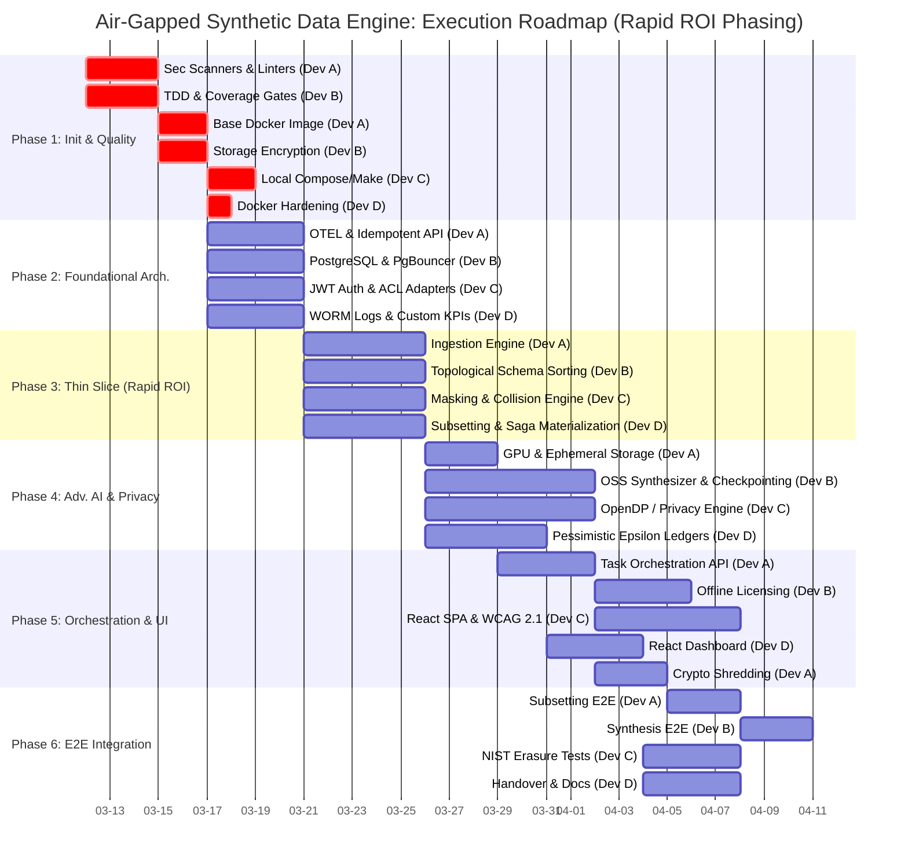

# Air-Gapped Synthetic Data Generation Engine: Execution Plan

This execution plan translates the Business and Architectural requirements into a phased, prioritized task list designed for execution by a development team of up to four (4) people. The plan ensures strict adherence to the **Constitutional Directives** by establishing unbreakable security and quality gates before any domain work begins.

## Phases Overview & Dependencies

The tasks below are structured to maximize parallel workstreams (up to 4 developers) while respecting critical path dependencies. 

* **Phase 1: Project Initialization & Quality Gates (Sequential Priority 0)**
  * *Dependency:* Blocked by nothing. Must be completed before any other work begins.
* **Phase 2: Foundational Architecture & Shared Services (Parallelizable)**
  * *Dependency:* Blocked by Phase 1.
* **Phase 3: Data Ingestion & Profiling (Parallelizable)** 
  * *Dependency:* Blocked by Phase 2.
* **Phase 4: Synthesis, Masking & Privacy (Parallelizable)**
  * *Dependency:* Blocked by Phase 3.
* **Phase 5: Orchestration, UI, & Licensing (Parallelizable)**
  * *Dependency:* Blocked by Phase 4.
* **Phase 6: Integration, Audit & Finalization (Parallelizable/Sequential)**
  * *Dependency:* Blocked by Phase 5.

---

## Detailed Task Breakdown

### Phase 1: Project Initialization & Quality Gates
**Goal:** Establish the unbreakable security & quality gates (Priority 0 & 1). No code can be written until this infrastructure enforces the Constitution.
* **Task 1.1 [Dev A]:** Configure CI/CD Pipeline & Security/Quality Scanners (`gitleaks`, `bandit`, `ruff`, `mypy`, `trivy`, `pip-audit`, SBOM generation, `axe-core` accessibility static analysis, and structural `import-linter`). *Critical Path.*
* **Task 1.2 [Dev B]:** Setup TDD Framework (`pytest`, `pytest-cov`, and `pytest-postgresql` for transaction rollbacks) with enforcement gates (fail < 90%). *Critical Path.*
* **Task 1.3 [Dev A]:** Construct Base Docker Image (Node.js build stage, Python final stage, `tini` / `su-exec` privilege dropping entrypoint). *Blocked by 1.1 & 1.2*
* **Task 1.4 [Dev B]:** Configure Container Security & Storage Policies (LUKS-based encrypted volumes and `IPC_LOCK` memory allocations). *Blocked by 1.1 & 1.2*
* **Task 1.5 [Dev C]:** Establish Local Developer Experience (Create structured `docker-compose.yml` with bind mounts for Uvicorn hot-reloading, local MinIO, local Jaeger UI, and DB `seeds.py`). *Blocked by 1.3*
* **Task 1.6 [Dev D]:** Docker Hardening (Enforce `--read-only` root filesystems for production containers and disable Redis disk dumps). *Blocked by 1.4*

### Phase 2: Foundational Architecture & Shared Services
**Goal:** Scaffold the Python modular monolith structure, the PostgreSQL database, and cross-cutting security/utility services.
* **Task 2.1 [Dev A]:** Implement the Module & Bootstrapper (FastAPI native `Depends()`), OpenTelemetry context injection for background Huey tasks, and Redis/TTL-based Idempotency Key checks.
* **Task 2.2 [Dev B]:** Develop the PostgreSQL Database configuration via Docker Compose (with PgBouncer connection pooling), base SQLModel ORM models, and Application-Level Encryption (ALE) for PII fields.
* **Task 2.3 [Dev C]:** Implement JWT Authentication & authorization middleware with granular scopes, and strictly enforce IP/mTLS Certificate binding to prevent token replay attacks.
* **Task 2.4 [Dev D]:** Develop Cryptographic "Vault Unseal" API, lightweight internal mTLS CA for inter-container traffic, WORM-compliant Cryptographically Signed Audit Logger, and `/metrics`.

### Phase 3: The "Thin Slice" (Rapid ROI - Ingest, Subset, Egress)
**Goal:** Deliver immediate business value to QA Engineers by establishing the end-to-end pipeline for deterministic masking and subsetting, deferring complex AI.
* **Task 3.1 [Dev A]:** Build the Ingestion Engine (Database connections, I/O protocols).
* **Task 3.2 [Dev B]:** Implement Relational Mapping (Schema inference, explicit and virtual foreign key mapping via streaming topological sort). 
* **Task 3.3 [Dev C]:** Build the Deterministic Masking Engine (Format-preserving algorithms, collision prevention, and LUHN checks for SSN, CC, etc.).
* **Task 3.4 [Dev D]:** Build the Subsetting & Materialization Core (Relational transversal for percentage slicing, Saga rollbacks, and secure egress to sink).

### Phase 4: Advanced Generative AI & Differential Privacy
**Goal:** Implement complex, GPU-accelerated data generation workflows utilizing established open-source ML libraries (OpenDP, SDV) to avoid bespoke R&D TCO.
* **Task 4.1 [Dev A]:** Integrate GPU Passthrough (`nvidia-container-toolkit`) alongside an ephemeral Object/Blob storage container.
* **Task 4.2 [Dev B]:** Integrate Open-Source Synthesizer (e.g., SDV) with batching/checkpointing and Statistical Profiler.
* **Task 4.3 [Dev C]:** Integrate Open-Source Differential Privacy (e.g., OpenDP, SmartNoise) and Pre-flight OOM Memory Guardrails.
* **Task 4.4 [Dev D]:** Build the Privacy Accountant Logic (Authorize/reject generation operations based on Epsilon ledger limits utilizing pessimistic locking).

### Phase 5: Orchestration, UI, & Licensing
**Goal:** Fulfill the WCAG 2.1 AA mandates, deliver the offline dashboard via React, and secure network licensing.
* **Task 5.1 [Dev A]:** Build the Task Orchestration API (FastAPI endpoints wrapping Huey jobs, Webhook emitter for agents, Cursor-Based Pagination, RFC 7807 formatting, and `datamodel-code-generator` schema sync).
* **Task 5.2 [Dev B]:** Implement the Offline License Activation Protocol (QR Challenge generation, JWT offline validation bounding MAC/Node usage).
* **Task 5.3 [Dev C]:** Build the base Accessible React SPA (Strict WCAG 2.1 AA adherence, offline asset bundling, setup `Vault Unseal` interception router).
* **Task 5.4 [Dev D]:** Develop the Data Synthesis Dashboard (Asynchronous task progress UX, WebSockets/polling connection to Huey, privacy budget metrics).
* **Task 5.5 [Dev A]:** Implement Cryptographic Shredding & Re-Keying API (Rotate Application-Level Encryption keys and zeroize old master constraints). *Blocked by 2.2, 5.1*

### Phase 6: Integration, Audit & Finalization
**Goal:** Validate all components working in unison, enforce NIST erasure, and prepare for handover.
* **Task 6.1 [Dev A]:** Execute End-to-End (E2E) Integration Tests for the complete Subsetting & Deterministic Masking workflow (utilizing pristine database rollbacks via `pytest-postgresql`). *Blocked by 3.4*
* **Task 6.2 [Dev B]:** Execute E2E Integration Tests for the full Generative Synthesis workflow (utilizing Dummy ML assertions for CI/CD speed). *Blocked by 6.1, 4.3, 4.4*
* **Task 6.3 [Dev C]:** Validate NIST SP 800-88 Cryptographic Erasure triggers, OWASP validation, and LLM/Agentic Fuzz Testing against JSON depth limits and ML layer Float-point NaNs.
* **Task 6.4 [Dev D]:** Final Security Remediation, Documentation generation, and Platform Handover validation.

---

## Project Gantt Chart

The following Gantt chart visualizes the execution sequence, illustrating strict barriers (e.g., Phase 1) and parallel execution across the 4-person development team.

