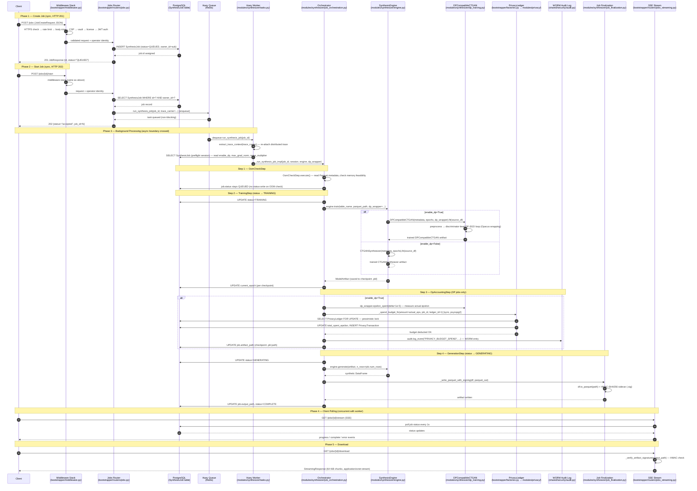
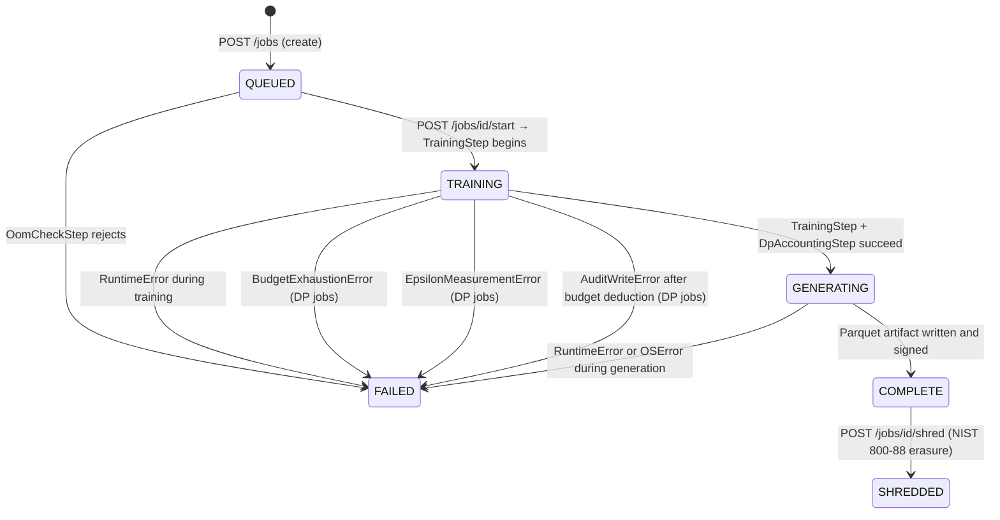

# Request Flow Documentation

**Audience**: A developer tracing a synthesis request from HTTP entry to database and back.

**Purpose**: Eliminate the need to read 10+ files to understand a single end-to-end request.
Every file reference, function name, and status transition in this document has been
verified against the actual source code.

---

## Table of Contents

1. [Architecture Overview](#1-architecture-overview)
2. [Full Sequence Diagram](#2-full-sequence-diagram)
3. [Async/Sync Boundary](#3-asyncsync-boundary)
4. [Step-by-Step Annotated File Reference](#4-step-by-step-annotated-file-reference)
   - [Step 0: Middleware Stack (every request)](#step-0-middleware-stack-every-request)
   - [Step 1: Create Job — POST /jobs](#step-1-create-job--post-jobs)
   - [Step 2: Start Job — POST /jobs/{id}/start](#step-2-start-job--post-jobsidstart)
   - [Step 3: Huey Task Entry Point](#step-3-huey-task-entry-point)
   - [Step 4: OOM Pre-flight Check](#step-4-oom-pre-flight-check)
   - [Step 5: CTGAN Training](#step-5-ctgan-training)
   - [Step 6: DP Accounting and Budget Deduction](#step-6-dp-accounting-and-budget-deduction)
   - [Step 7: Synthetic Data Generation and Artifact Signing](#step-7-synthetic-data-generation-and-artifact-signing)
   - [Step 8: Job Finalization](#step-8-job-finalization)
   - [Step 9: Client Observes Progress — GET /jobs/{id}/stream](#step-9-client-observes-progress--get-jobsidstream)
   - [Step 10: Artifact Download — GET /jobs/{id}/download](#step-10-artifact-download--get-jobsiddownload)
5. [Job Status Lifecycle](#5-job-status-lifecycle)
6. [DI Wiring at Startup](#6-di-wiring-at-startup)
7. [Common Modification Points](#7-common-modification-points)
   - [Adding a New Masking Algorithm](#adding-a-new-masking-algorithm)
   - [Adding a New Synthesis Model](#adding-a-new-synthesis-model)
   - [Modifying Privacy Accounting](#modifying-privacy-accounting)

---

## 1. Architecture Overview

The synthesis request path crosses two distinct runtime contexts:

- **FastAPI process** (async, uvicorn): Handles HTTP, JWT auth, request validation,
  and persists the `SynthesisJob` record. Enqueues background work via Huey.
- **Huey worker process** (sync, Redis-backed): Performs the computationally expensive
  training loop, DP accounting, and artifact generation. Runs as a separate OS process.

The Huey queue (Redis) is the only coupling between these two contexts. The worker
discovers tasks because `bootstrapper/main.py` imports
`synth_engine.modules.synthesizer.tasks` at startup, which registers `run_synthesis_job`
with the shared Huey instance in `shared/task_queue.py`.

---

## 2. Full Sequence Diagram



---

## 3. Async/Sync Boundary

Understanding where the async/sync boundary sits is essential when debugging or adding code.

### FastAPI Routes are Sync

All job lifecycle routes in `bootstrapper/routers/jobs.py` are **synchronous** (`def`,
not `async def`). FastAPI runs sync handlers in a thread pool via `anyio.to_thread`,
so they never block the event loop. The synchronous route handlers use a **sync**
`sqlmodel.Session` provided by `bootstrapper/dependencies/db.get_db_session`.

The SSE endpoint `GET /jobs/{id}/stream` in `bootstrapper/routers/jobs_streaming.py`
is `async def` because it needs to hold an open connection while polling.

### Huey Worker is Sync

`run_synthesis_job` in `modules/synthesizer/tasks.py` runs in the Huey worker process,
which is **not** an async event loop. This is why:

1. The Huey task opens a **sync** `sqlmodel.Session` (not `AsyncSession`).
2. The `_spend_budget_fn` injected by `bootstrapper/factories.build_spend_budget_fn()`
   uses a **sync** SQLAlchemy engine with the psycopg2 driver (see ADR-0035), not the
   asyncpg driver used by API routes.
3. The async `spend_budget()` function in `modules/privacy/accountant.py` is **not
   called directly** from the Huey worker — only from async API routes.

### The Crossing Point

```
POST /jobs/{id}/start   ← sync FastAPI route (thread pool)
  └─ run_synthesis_job(job_id, trace_carrier=...)
       └─ huey.task() enqueue  ← this call pushes to Redis; non-blocking
            [ASYNC/SYNC BOUNDARY — Redis queue]
  Worker picks up from Redis
       └─ run_synthesis_job() body executes ← sync Huey worker
```

The trace context is carried across this boundary via `inject_trace_context()` at
dispatch time and `extract_trace_context()` in the worker (T25.2), preserving the
distributed trace span chain.

### Database Driver Mapping

| Context | Driver | Session type | Key function |
|---------|--------|--------------|--------------|
| FastAPI routes | `asyncpg` (`postgresql+asyncpg://`) | `AsyncSession` | `shared/db.get_async_session` |
| FastAPI sync routes | sync psycopg2 (via SQLModel) | `Session` | `bootstrapper/dependencies/db.get_db_session` |
| Huey worker | sync psycopg2 (`postgresql://`) | `Session` | `shared/db.get_engine` |
| `_spend_budget_fn` | sync psycopg2 (`NullPool`) | `sqlalchemy.orm.Session` | `bootstrapper/factories.build_spend_budget_fn` |

`bootstrapper/factories._promote_to_sync_url()` converts `postgresql+asyncpg://` to
`postgresql://` before constructing the Huey-side engine so the worker never calls
`asyncio.run()` from a non-greenlet context.

---

## 4. Step-by-Step Annotated File Reference

### Step 0: Middleware Stack (every request)

Every HTTP request passes through the middleware stack defined in
`src/synth_engine/bootstrapper/middleware.py` before reaching any route handler.

Middleware executes in LIFO order (last registered = outermost = fires first on request):

| Order (request path) | Middleware class | File | Rejects with |
|----------------------|-----------------|------|-------------|
| 1st (outermost) | `HTTPSEnforcementMiddleware` | `bootstrapper/dependencies/https_enforcement.py` | 421 in production if plain HTTP |
| 2nd | `RateLimitGateMiddleware` | `bootstrapper/dependencies/rate_limit.py` | 429 + `Retry-After` on rate limit |
| 3rd | `RequestBodyLimitMiddleware` | `bootstrapper/dependencies/request_limits.py` | 413 (>1 MiB) or 400 (depth >100) |
| 4th | `CSPMiddleware` | `bootstrapper/dependencies/csp.py` | adds `Content-Security-Policy` header |
| 5th | `SealGateMiddleware` | `bootstrapper/dependencies/vault.py` | 423 if vault sealed |
| 6th | `LicenseGateMiddleware` | `bootstrapper/dependencies/licensing.py` | 402 if not licensed |
| 7th (innermost) | `AuthenticationGateMiddleware` | `bootstrapper/dependencies/auth.py` | 401 if JWT absent or invalid |

The middleware is assembled by `setup_middleware()` in `bootstrapper/middleware.py`,
which is called from `create_app()` in `bootstrapper/main.py`.

### Step 1: Create Job — POST /jobs

**File**: `src/synth_engine/bootstrapper/routers/jobs.py`
**Function**: `create_job(body, session, current_operator)`

1. Receives a `JobCreateRequest` Pydantic model (validated by FastAPI).
   Schema defined in `bootstrapper/schemas/jobs.py`.
2. Constructs a `SynthesisJob` SQLModel record with `status="QUEUED"` and
   `owner_id` set from the JWT `sub` claim (`current_operator`).
3. Persists the record via sync `sqlmodel.Session`.
4. Returns a `JobResponse` with HTTP 201.

The job record at this point contains: `table_name`, `parquet_path`, `total_epochs`,
`num_rows`, `checkpoint_every_n`, `enable_dp`, `noise_multiplier`, `max_grad_norm`,
`owner_id`. Model definition: `modules/synthesizer/job_models.py`.

No training starts here. The job is created in `QUEUED` status and waits for an
explicit start call.

### Step 2: Start Job — POST /jobs/{id}/start

**File**: `src/synth_engine/bootstrapper/routers/jobs.py`
**Function**: `start_job(job_id, session, current_operator)`

1. Looks up `SynthesisJob` by `job_id`. Returns 404 (RFC 7807) if not found **or**
   if `owner_id != current_operator` (IDOR protection — 404 not 403).
2. Calls `run_synthesis_job(job_id, trace_carrier=inject_trace_context())`.
   - `inject_trace_context()` is from `shared/telemetry.py`. It packages the current
     OpenTelemetry span context into a W3C-compliant carrier dict.
   - This enqueue call is **synchronous and non-blocking** — it pushes a message to
     Redis and returns immediately.
3. Returns HTTP 202 `{"status": "accepted", "job_id": N}`.

Dispatch site for the Huey task. The trace carrier enables cross-process distributed
tracing (T25.2).

### Step 3: Huey Task Entry Point

**File**: `src/synth_engine/modules/synthesizer/tasks.py`
**Function**: `run_synthesis_job(job_id, trace_carrier=None)`

This is the `@huey.task()` decorated function that runs in the Huey worker process.
The function body:

1. Calls `extract_trace_context(trace_carrier)` to re-attach the distributed trace
   context from the API request.
2. Opens a **preflight** `sqlmodel.Session` to read `job.enable_dp`,
   `job.max_grad_norm`, and `job.noise_multiplier`.
3. If `enable_dp=True`, constructs a `DPTrainingWrapper` via the injected
   `_dp_wrapper_factory` (registered at startup in `bootstrapper/main.py` via
   `set_dp_wrapper_factory(build_dp_wrapper)`).
4. Opens a **main** `sqlmodel.Session` and delegates to `_run_synthesis_job_impl()`.

The factory injection (`_dp_wrapper_factory`, `_spend_budget_fn`) is the dependency
inversion mechanism that keeps `modules/synthesizer` from importing directly from
`modules/privacy` or `bootstrapper`. The bootstrapper is the only layer that holds
references to both modules simultaneously.

### Step 4: OOM Pre-flight Check

**File**: `src/synth_engine/modules/synthesizer/job_orchestration.py`
**Class**: `OomCheckStep`
**Function**: `OomCheckStep.execute(ctx)`

The first step in the pipeline. Calls `check_memory_feasibility()` from
`modules/synthesizer/guardrails.py` using:
- Parquet row and column counts read via `_get_parquet_dimensions()` (uses pyarrow).
- `_OOM_OVERHEAD_FACTOR = 6.0` and `_OOM_DTYPE_BYTES = 8`.

If memory is insufficient, returns `StepResult(success=False)` — the orchestrator
sets `job.status = "FAILED"` and returns. No status write occurs during the OOM
check itself (the orchestrator is the sole owner of status transitions).

### Step 5: CTGAN Training

**File**: `src/synth_engine/modules/synthesizer/job_orchestration.py`
**Class**: `TrainingStep`
**Function**: `TrainingStep.execute(ctx)`

1. Sets `job.status = "TRAINING"` via the orchestrator (before `TrainingStep` fires).
2. Calls `ctx.engine.train(table_name, parquet_path, dp_wrapper=ctx.dp_wrapper)`.
   - **Engine file**: `modules/synthesizer/engine.py`, class `SynthesisEngine`.
   - If `dp_wrapper` is `None`: uses `CTGANSynthesizer` from `sdv`.
   - If `dp_wrapper` is set: uses `DPCompatibleCTGAN` from `modules/synthesizer/dp_training.py`.
3. Saves a checkpoint `.pkl` file per epoch chunk (`job_N_epoch_K.pkl`).
4. Updates `job.current_epoch` after each checkpoint.
5. Stores `ctx.last_artifact` (the `ModelArtifact`) and `ctx.last_ckpt_path` for
   downstream steps.

**DP path detail** (`modules/synthesizer/dp_training.py`, class `DPCompatibleCTGAN`):

- `fit()` calls `_preprocess()` (SDV DataProcessor) then `_train_dp_discriminator()`.
- `_train_dp_discriminator()` runs a WGAN loop with the Opacus-wrapped discriminator
  (`modules/synthesizer/dp_discriminator.py`, class `OpacusCompatibleDiscriminator`).
- The `dp_wrapper.wrap()` call activates the `opacus.PrivacyEngine` on the
  discriminator optimizer (ADR-0036).
- `dp_wrapper.check_budget()` is called after every epoch as a mid-training guard.
- On failure, falls back to `_activate_opacus_proxy()` + vanilla `CTGANSynthesizer`.

### Step 6: DP Accounting and Budget Deduction

**File**: `src/synth_engine/modules/synthesizer/job_orchestration.py`
**Class**: `DpAccountingStep`
**Function**: `DpAccountingStep.execute(ctx)` → `_handle_dp_accounting()`

Skipped entirely if `ctx.dp_wrapper is None` (vanilla job).

For DP jobs:

1. Calls `dp_wrapper.epsilon_spent(delta=1e-5)` to measure the actual epsilon consumed
   during training. Sets `job.actual_epsilon`.
2. Calls `_spend_budget_fn(amount=actual_eps, job_id, ledger_id=1, note=...)`.
   - This function is injected by the bootstrapper via `set_spend_budget_fn()`.
   - The concrete implementation is `build_spend_budget_fn()._sync_wrapper` from
     `bootstrapper/factories.py` — a **sync** function using a psycopg2 engine
     (ADR-0035, avoids `MissingGreenlet` in Huey context).
   - Internally: `SELECT PrivacyLedger FOR UPDATE`, budget check, UPDATE + INSERT
     `PrivacyTransaction`, COMMIT.
   - On `BudgetExhaustionError`: re-raises — `DpAccountingStep` returns failure.
3. After successful budget deduction, calls `audit.log_event("PRIVACY_BUDGET_SPEND")`
   on the WORM audit logger (`shared/security/audit.py`).
   - If the audit write fails (`AuditWriteError`), the job is marked FAILED (T38.1 —
     Constitution Priority 0: every privacy budget spend must have a WORM entry).

The async `spend_budget()` in `modules/privacy/accountant.py` has the same
pessimistic-locking logic but is only called from async API routes (e.g.,
`bootstrapper/routers/privacy.py`), never from the Huey worker.

### Step 7: Synthetic Data Generation and Artifact Signing

**File**: `src/synth_engine/modules/synthesizer/job_orchestration.py`
**Class**: `GenerationStep`
**Function**: `GenerationStep.execute(ctx)`

1. Orchestrator sets `job.status = "GENERATING"` before this step fires.
2. Calls `ctx.engine.generate(ctx.last_artifact, n_rows=job.num_rows)`.
   - Returns a `pandas.DataFrame` of synthetic rows.
3. Calls `_write_parquet_with_signing(synthetic_df, parquet_out)` from
   `modules/synthesizer/job_finalization.py`.

**Artifact signing** (`modules/synthesizer/job_finalization.py`):

- Calls `df.to_parquet(path, index=False)` via pandas.
- Checks settings for `ARTIFACT_SIGNING_KEYS` / `ARTIFACT_SIGNING_KEY_ACTIVE`
  (versioned mode, T42.1) or `ARTIFACT_SIGNING_KEY` (legacy mode).
- Versioned: writes `KEY_ID (4 bytes) || HMAC-SHA256 (32 bytes)` sidecar `.sig` via
  `shared/security/hmac_signing.sign_versioned()`.
- Legacy: writes bare 32-byte HMAC sidecar via `shared/security/hmac_signing.compute_hmac()`.
- If no signing key is configured, logs WARNING and writes artifact unsigned.

Sets `job.output_path` to the Parquet file path on success.

### Step 8: Job Finalization

**File**: `src/synth_engine/modules/synthesizer/job_orchestration.py`
**Function**: `_run_synthesis_job_impl()` (orchestrator)

After `GenerationStep` returns success:

1. Sets `job.status = "COMPLETE"`.
2. Commits to the database.
3. Logs `"Job N: COMPLETE (output=...)"`.

Any step failure (OOM, RuntimeError in training, BudgetExhaustion, AuditWriteError,
or generation I/O error) causes:

1. `job.status = "FAILED"`.
2. `job.error_msg = result.error_msg` (sanitized via `shared/errors.safe_error_msg()`).
3. Commit and return — the Huey worker marks the task completed from the queue's
   perspective; failure is tracked in the database record.

### Step 9: Client Observes Progress — GET /jobs/{id}/stream

**File**: `src/synth_engine/bootstrapper/routers/jobs_streaming.py`
**Function**: `stream_job(job_id, session, current_operator)`

An `async def` SSE endpoint. Uses `sse_starlette.EventSourceResponse` wrapping
the `job_event_stream()` generator from `bootstrapper/sse.py`.

The SSE generator polls the database every `_SSE_POLL_INTERVAL = 1.0` second,
opening its own `Session` via a factory built from the bound engine
(`_make_session_factory(session)`). The injected route session is closed when the
route function returns; the SSE generator keeps its own sessions open for the
lifetime of the SSE connection.

Events yielded:

| Event type | Condition |
|-----------|-----------|
| `progress` | `status == "TRAINING"` or `"GENERATING"` |
| `complete` | `status == "COMPLETE"` |
| `error` | `status == "FAILED"` |

IDOR protection: returns 404 if `job.owner_id != current_operator`.

### Step 10: Artifact Download — GET /jobs/{id}/download

**File**: `src/synth_engine/bootstrapper/routers/jobs_streaming.py`
**Function**: `download_job(job_id, session, current_operator)`

A sync `def` endpoint that:

1. Fetches the `SynthesisJob` record (404 on IDOR mismatch).
2. Checks `job.status == "COMPLETE"` (404 otherwise).
3. Checks `job.output_path is not None` and the file exists on disk.
4. Calls `_verify_artifact_signature(job.output_path)`:
   - Reads the `.sig` sidecar file.
   - Determines format (versioned 36-byte or legacy 32-byte).
   - Resolves the key from `shared/security/hmac_signing.build_key_map_from_settings()`.
   - Computes HMAC incrementally in 64 KiB chunks (never loads entire Parquet into memory).
   - Returns `True` (verified), `False` (tampered), or `None` (signing disabled).
   - `False` → 409 Conflict (artifact tampering detected).
5. Returns a `StreamingResponse` reading `job.output_path` in 64 KiB chunks with
   `Content-Disposition: attachment; filename="<table_name>-synthetic.parquet"`.

---

## 5. Job Status Lifecycle



Status transitions are exclusively owned by `_run_synthesis_job_impl()` in
`job_orchestration.py` (AC4, ADR-0038). No step class sets `job.status` directly.

---

## 6. DI Wiring at Startup

The bootstrapper wires dependencies at module-import time, before any request is served.
This happens in `bootstrapper/main.py` at module scope (Rule 8, ADR-0029):

```python
# bootstrapper/main.py (lines 135-139)
from synth_engine.modules.synthesizer import tasks as _synthesizer_tasks

_synthesizer_tasks.set_dp_wrapper_factory(build_dp_wrapper)    # DI: ADR-0029
_synthesizer_tasks.set_spend_budget_fn(build_spend_budget_fn())  # DI: T22.3
```

This has two effects:

1. **Task registration**: Importing `tasks` registers `run_synthesis_job` with the
   shared Huey instance (`shared/task_queue.huey`). The Huey worker discovers tasks
   by importing the same module.
2. **Factory injection**: `set_dp_wrapper_factory()` and `set_spend_budget_fn()` write
   module-level globals in `job_orchestration.py`. When a Huey task later reads
   `_orch._dp_wrapper_factory`, it sees the live injected value — not `None`.

The factories (`build_dp_wrapper`, `build_spend_budget_fn`) are defined in
`bootstrapper/factories.py`. This is the **only** place where `modules/privacy` and
`modules/synthesizer` are connected — the bootstrapper is the sole layer permitted to
import from both simultaneously (import-linter contract enforcement).

---

## 7. Common Modification Points

### Adding a New Masking Algorithm

Masking is independent of the synthesis pipeline. No changes to the request flow are
needed.

1. Write the algorithm in `src/synth_engine/modules/masking/algorithms.py`.
2. Register it in `src/synth_engine/modules/masking/registry.py`.
3. Wire it into the masking pipeline in `src/synth_engine/modules/masking/deterministic.py`.
4. Expose it via `bootstrapper/routers/` if a new API endpoint is needed.
5. Follow TDD: write failing tests in `tests/unit/masking/` first.

Key files:

| File | Purpose |
|------|---------|
| `modules/masking/algorithms.py` | Algorithm implementations (FPE, Luhn, hash) |
| `modules/masking/registry.py` | Algorithm registry (name → function) |
| `modules/masking/deterministic.py` | Column masking orchestration |
| `modules/masking/luhn.py` | Luhn-valid card number masking |

### Adding a New Synthesis Model

To replace or supplement CTGAN with a different generative model:

1. The new model must satisfy the duck-typed contract expected by `SynthesisEngine`:
   - `model.fit(df)` — train on a pandas DataFrame.
   - `model.sample(num_rows=N)` — return a DataFrame with N rows.
2. Add the new model class in `modules/synthesizer/` (e.g., `vae_model.py`).
3. Modify `SynthesisEngine.train()` in `modules/synthesizer/engine.py` to select
   the new model based on a parameter.
4. If the new model requires GPU dependencies, wrap the import in a
   `try/except ImportError` block (see conditional imports pattern in `engine.py`).
5. Add the new dependency to `pyproject.toml` under `[tool.poetry.group.synthesizer]`.
6. Write an ADR if the technology substitution is significant (Rule 6, CLAUDE.md).

The `DPWrapperProtocol` in `shared/protocols.py` defines the DP training interface.
Any new model that supports DP-SGD must satisfy this protocol for the accounting and
budget steps to work correctly.

### Modifying Privacy Accounting

The privacy accounting chain involves three files and two runtime contexts:

| Context | File | Function | When called |
|---------|------|----------|------------|
| Huey worker (sync) | `bootstrapper/factories.py` | `build_spend_budget_fn()._sync_wrapper` | After DP training, in Huey task |
| FastAPI route (async) | `modules/privacy/accountant.py` | `spend_budget()` | From async privacy API routes |
| Huey worker | `modules/synthesizer/job_orchestration.py` | `_handle_dp_accounting()` | Calls `_spend_budget_fn` |
| Huey worker | `shared/security/audit.py` | `audit.log_event("PRIVACY_BUDGET_SPEND")` | After budget deduction succeeds |

To change the epsilon accounting logic:

1. Modify `modules/privacy/accountant.py:spend_budget()` for the async API path.
2. Modify `bootstrapper/factories.py:build_spend_budget_fn()._sync_wrapper` for the
   Huey path. These two functions must implement the same pessimistic-locking protocol
   (`SELECT ... FOR UPDATE`).
3. Both functions share the ledger model in `modules/privacy/ledger.py`
   (`PrivacyLedger`, `PrivacyTransaction`).
4. The epsilon measurement (reading actual epsilon after training) is in
   `job_orchestration._handle_dp_accounting()` via `dp_wrapper.epsilon_spent()`.
   The concrete DP wrapper is `modules/privacy/dp_engine.DPTrainingWrapper`.

To change the allocated budget or add per-operator budget isolation, modify the
`PrivacyLedger` model in `modules/privacy/ledger.py` and the corresponding
Alembic migration in `alembic/versions/`.
