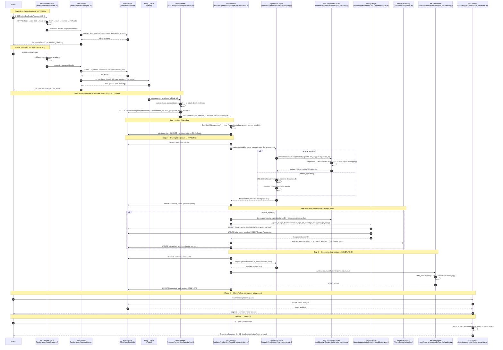
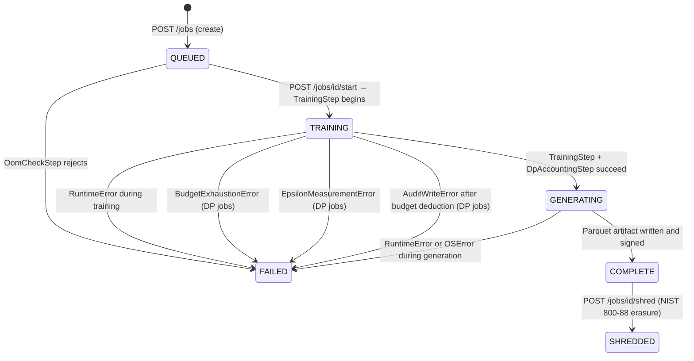

# Request Flow Documentation

> **Amendment (Phase 56):** File paths updated to reflect synthesizer sub-package decomposition.

**Audience**: Developer tracing a synthesis request from HTTP entry to database and back.

**Purpose**: Eliminate the need to read 10+ files to understand a single end-to-end request. Every file reference, function name, and status transition has been verified against source code.

---

## Table of Contents

1. [Architecture Overview](#1-architecture-overview)
2. [Full Sequence Diagram](#2-full-sequence-diagram)
3. [Async/Sync Boundary](#3-asyncsync-boundary)
4. [Step-by-Step Annotated File Reference](#4-step-by-step-annotated-file-reference)
   - [Step 0: Middleware Stack](#step-0-middleware-stack-every-request)
   - [Step 1: Create Job — POST /jobs](#step-1-create-job--post-jobs)
   - [Step 2: Start Job — POST /jobs/{id}/start](#step-2-start-job--post-jobsidstart)
   - [Step 3: Huey Task Entry Point](#step-3-huey-task-entry-point)
   - [Step 4: OOM Pre-flight Check](#step-4-oom-pre-flight-check)
   - [Step 5: CTGAN Training](#step-5-ctgan-training)
   - [Step 6: DP Accounting and Budget Deduction](#step-6-dp-accounting-and-budget-deduction)
   - [Step 7: Synthetic Data Generation and Artifact Signing](#step-7-synthetic-data-generation-and-artifact-signing)
   - [Step 8: Job Finalization](#step-8-job-finalization)
   - [Step 9: Client Observes Progress — GET /jobs/{id}/stream](#step-9-client-observes-progress--get-jobsidstream)
   - [Step 10: Artifact Download — GET /jobs/{id}/download](#step-10-artifact-download--get-jobsiddownload)
5. [Job Status Lifecycle](#5-job-status-lifecycle)
6. [DI Wiring at Startup](#6-di-wiring-at-startup)
7. [Common Modification Points](#7-common-modification-points)

---

## 1. Architecture Overview

The synthesis request path crosses two runtime contexts:

- **FastAPI process** (async, uvicorn): HTTP, JWT auth, request validation, `SynthesisJob` persistence, Huey enqueue.
- **Huey worker process** (sync, Redis-backed): training loop, DP accounting, artifact generation. Separate OS process.

The Huey queue (Redis) is the only coupling between contexts. The worker discovers tasks because `bootstrapper/main.py` imports `synth_engine.modules.synthesizer.jobs.tasks` at startup, registering `run_synthesis_job` with the shared Huey instance in `shared/task_queue.py`.

---

## 2. Full Sequence Diagram



---

## 3. Async/Sync Boundary

### FastAPI Routes are Sync

All job lifecycle routes in `bootstrapper/routers/jobs.py` are **synchronous** (`def`). FastAPI runs them in a thread pool via `anyio.to_thread` — they never block the event loop. They use a sync `sqlmodel.Session` from `bootstrapper/dependencies/db.get_db_session`.

The SSE endpoint `GET /jobs/{id}/stream` is `async def` (needs to hold an open connection while polling).

### Huey Worker is Sync

`run_synthesis_job` runs in the Huey worker process — not an async event loop. Therefore:

1. The Huey task opens a **sync** `sqlmodel.Session`.
2. `_spend_budget_fn` uses a **sync** SQLAlchemy engine with psycopg2 (ADR-0035) — not asyncpg.
3. The async `spend_budget()` in `modules/privacy/accountant.py` is **never called from Huey** — only from async API routes.

### The Crossing Point

```
POST /jobs/{id}/start   ← sync FastAPI route (thread pool)
  └─ run_synthesis_job(job_id, trace_carrier=...)
       └─ huey.task() enqueue  ← pushes to Redis; non-blocking
            [ASYNC/SYNC BOUNDARY — Redis queue]
  Worker picks up from Redis
       └─ run_synthesis_job() body executes ← sync Huey worker
```

Trace context crosses this boundary via `inject_trace_context()` at dispatch and `extract_trace_context()` in the worker (T25.2).

### Database Driver Mapping

| Context | Driver | Session type | Key function |
|---------|--------|--------------|--------------|
| FastAPI routes | `asyncpg` (`postgresql+asyncpg://`) | `AsyncSession` | `shared/db.get_async_session` |
| FastAPI sync routes | sync psycopg2 (via SQLModel) | `Session` | `bootstrapper/dependencies/db.get_db_session` |
| Huey worker | sync psycopg2 (`postgresql://`) | `Session` | `shared/db.get_engine` |
| `_spend_budget_fn` | sync psycopg2 (`NullPool`) | `sqlalchemy.orm.Session` | `bootstrapper/factories.build_spend_budget_fn` |

`bootstrapper/factories._promote_to_sync_url()` converts `postgresql+asyncpg://` to `postgresql://` for the Huey-side engine.

---

## 4. Step-by-Step Annotated File Reference

### Step 0: Middleware Stack (every request)

Defined in `bootstrapper/middleware.py`. Executes in LIFO order (last registered = outermost = fires first):

| Order | Middleware class | File | Rejects with |
|-------|-----------------|------|-------------|
| 1st (outermost) | `HTTPSEnforcementMiddleware` | `bootstrapper/dependencies/https_enforcement.py` | 421 in production if plain HTTP |
| 2nd | `RateLimitGateMiddleware` | `bootstrapper/dependencies/rate_limit.py` | 429 + `Retry-After` |
| 3rd | `RequestBodyLimitMiddleware` | `bootstrapper/dependencies/request_limits.py` | 413 (>1 MiB) or 400 (depth >100) |
| 4th | `CSPMiddleware` | `bootstrapper/dependencies/csp.py` | adds `Content-Security-Policy` header |
| 5th | `SealGateMiddleware` | `bootstrapper/dependencies/vault.py` | 423 if vault sealed |
| 6th | `LicenseGateMiddleware` | `bootstrapper/dependencies/licensing.py` | 402 if not licensed |
| 7th (innermost) | `AuthenticationGateMiddleware` | `bootstrapper/dependencies/auth.py` | 401 if JWT absent/invalid |

### Step 1: Create Job — POST /jobs

**File**: `bootstrapper/routers/jobs.py` — `create_job(body, session, current_operator)`

1. Receives `JobCreateRequest` (validated by FastAPI; schema in `bootstrapper/schemas/jobs.py`).
2. Constructs `SynthesisJob` with `status="QUEUED"` and `owner_id` from JWT `sub`.
3. Persists via sync `sqlmodel.Session`. Returns `JobResponse` HTTP 201.

Job record contains: `table_name`, `parquet_path`, `total_epochs`, `num_rows`, `checkpoint_every_n`, `enable_dp`, `noise_multiplier`, `max_grad_norm`, `owner_id`. Model: `modules/synthesizer/jobs/job_models.py`.

No training starts here — the job waits for an explicit start call.

### Step 2: Start Job — POST /jobs/{id}/start

**File**: `bootstrapper/routers/jobs.py` — `start_job(job_id, session, current_operator)`

1. Looks up `SynthesisJob` by `job_id`. Returns 404 if not found **or** if `owner_id != current_operator` (IDOR protection — 404 not 403).
2. Calls `run_synthesis_job(job_id, trace_carrier=inject_trace_context())` — pushes to Redis, non-blocking.
3. Returns HTTP 202 `{"status": "accepted", "job_id": N}`.

### Step 3: Huey Task Entry Point

**File**: `modules/synthesizer/jobs/tasks.py` — `run_synthesis_job(job_id, trace_carrier=None)`

1. `extract_trace_context(trace_carrier)` re-attaches the distributed trace.
2. Opens a preflight session to read `job.enable_dp`, `job.max_grad_norm`, `job.noise_multiplier`.
3. If `enable_dp=True`, constructs `DPTrainingWrapper` via injected `_dp_wrapper_factory` (wired in `bootstrapper/main.py` via `set_dp_wrapper_factory(build_dp_wrapper)`).
4. Opens main session and delegates to `_run_synthesis_job_impl()`.

The factory injection (`_dp_wrapper_factory`, `_spend_budget_fn`) is the DI mechanism that keeps `modules/synthesizer` from importing `modules/privacy` or `bootstrapper` directly.

### Step 4: OOM Pre-flight Check

**File**: `modules/synthesizer/jobs/job_orchestration.py` — `OomCheckStep.execute(ctx)`

Calls `check_memory_feasibility()` from `modules/synthesizer/training/guardrails.py` using Parquet row/column counts (via pyarrow), `_OOM_OVERHEAD_FACTOR = 6.0`, and `_OOM_DTYPE_BYTES = 8`.

On insufficient memory: returns `StepResult(success=False)`. The orchestrator sets `job.status = "FAILED"`. No status write occurs during the OOM check itself.

### Step 5: CTGAN Training

**File**: `modules/synthesizer/jobs/job_orchestration.py` — `TrainingStep.execute(ctx)`

1. Sets `job.status = "TRAINING"` (orchestrator sets status before `TrainingStep` fires).
2. Calls `ctx.engine.train(table_name, parquet_path, dp_wrapper=ctx.dp_wrapper)` (`modules/synthesizer/training/engine.py`, `SynthesisEngine`).
   - `dp_wrapper=None`: uses `CTGANSynthesizer` from `sdv`.
   - `dp_wrapper` set: uses `DPCompatibleCTGAN` from `modules/synthesizer/training/dp_training.py`.
3. Saves checkpoint `.pkl` per epoch chunk. Updates `job.current_epoch` after each checkpoint.

**DP path** (`modules/synthesizer/training/dp_training.py`, `DPCompatibleCTGAN`):
- `fit()` calls `_preprocess()` (SDV DataProcessor) then `_train_dp_discriminator()`.
- Runs a WGAN loop with Opacus-wrapped discriminator (`modules/synthesizer/training/dp_discriminator.py`, `OpacusCompatibleDiscriminator`).
- `dp_wrapper.wrap()` activates `opacus.PrivacyEngine` on the discriminator optimizer (ADR-0036).
- `dp_wrapper.check_budget()` called after every epoch as a mid-training guard.
- On failure: falls back to `_activate_opacus_proxy()` + vanilla `CTGANSynthesizer`.

### Step 6: DP Accounting and Budget Deduction

**File**: `modules/synthesizer/jobs/job_orchestration.py` — `DpAccountingStep.execute(ctx)` → `_handle_dp_accounting()`

Skipped entirely if `ctx.dp_wrapper is None`.

For DP jobs:
1. `dp_wrapper.epsilon_spent(delta=1e-5)` measures actual epsilon. Sets `job.actual_epsilon`.
2. `_spend_budget_fn(amount=actual_eps, job_id, ledger_id=1, note=...)` (injected by bootstrapper via `set_spend_budget_fn()`; sync psycopg2 per ADR-0035): `SELECT PrivacyLedger FOR UPDATE` → budget check → `UPDATE + INSERT PrivacyTransaction` → COMMIT. Raises `BudgetExhaustionError` on exhaustion.
3. `audit.log_event("PRIVACY_BUDGET_SPEND")` on WORM audit logger (`shared/security/audit.py`). If audit write fails (`AuditWriteError`), job is marked FAILED (T38.1 — Constitution Priority 0: every privacy spend must have a WORM entry).

The async `spend_budget()` in `modules/privacy/accountant.py` is only called from async API routes, never from Huey.

### Step 7: Synthetic Data Generation and Artifact Signing

**File**: `modules/synthesizer/jobs/job_orchestration.py` — `GenerationStep.execute(ctx)`

1. Orchestrator sets `job.status = "GENERATING"`.
2. `ctx.engine.generate(ctx.last_artifact, n_rows=job.num_rows)` → `pandas.DataFrame`.
3. `_write_parquet_with_signing(synthetic_df, parquet_out)` from `modules/synthesizer/jobs/job_finalization.py`:
   - `df.to_parquet(path, index=False)`.
   - Versioned mode (`ARTIFACT_SIGNING_KEYS` / `ARTIFACT_SIGNING_KEY_ACTIVE`, T42.1): writes `KEY_ID (4 bytes) || HMAC-SHA256 (32 bytes)` sidecar via `shared/security/hmac_signing.sign_versioned()`.
   - Legacy mode (`ARTIFACT_SIGNING_KEY`): writes bare 32-byte HMAC sidecar via `shared/security/hmac_signing.compute_hmac()`.
   - No signing key configured: logs WARNING, writes unsigned.
4. Sets `job.output_path`.

### Step 8: Job Finalization

**File**: `modules/synthesizer/jobs/job_orchestration.py` — `_run_synthesis_job_impl()`

After `GenerationStep` succeeds: `job.status = "COMPLETE"` → commit → log.

Any step failure (OOM, RuntimeError, `BudgetExhaustionError`, `AuditWriteError`, I/O error):
1. `job.status = "FAILED"`.
2. `job.error_msg = result.error_msg` (sanitized via `shared/errors.safe_error_msg()`).
3. Commit and return — Huey marks the task complete; failure is tracked in the DB record.

### Step 9: Client Observes Progress — GET /jobs/{id}/stream

**File**: `bootstrapper/routers/jobs_streaming.py` — `stream_job(job_id, session, current_operator)`

`async def` SSE endpoint using `sse_starlette.EventSourceResponse` wrapping `job_event_stream()` from `bootstrapper/sse.py`. Polls DB every `_SSE_POLL_INTERVAL = 1.0` second via its own session factory. IDOR protection: returns 404 if `job.owner_id != current_operator`.

| Event type | Condition |
|-----------|-----------|
| `progress` | `status == "TRAINING"` or `"GENERATING"` |
| `complete` | `status == "COMPLETE"` |
| `error` | `status == "FAILED"` |

### Step 10: Artifact Download — GET /jobs/{id}/download

**File**: `bootstrapper/routers/jobs_streaming.py` — `download_job(job_id, session, current_operator)`

Sync `def` endpoint:
1. Fetches `SynthesisJob` (404 on IDOR mismatch).
2. Checks `job.status == "COMPLETE"` (404 otherwise).
3. Verifies `job.output_path` exists on disk.
4. `_verify_artifact_signature(job.output_path)`: reads `.sig` sidecar, determines format (versioned 36-byte or legacy 32-byte), resolves key via `shared/security/hmac_signing.build_key_map_from_settings()`, computes HMAC in 64 KiB chunks. `False` → 409 Conflict (tampering detected).
5. Returns `StreamingResponse` in 64 KiB chunks with `Content-Disposition: attachment; filename="<table_name>-synthetic.parquet"`.

---

## 5. Job Status Lifecycle



Status transitions are exclusively owned by `_run_synthesis_job_impl()` in `job_orchestration.py` (AC4, ADR-0038). No step class sets `job.status` directly.

---

## 6. DI Wiring at Startup

In `bootstrapper/main.py` at module scope (Rule 8, ADR-0029):

```python
from synth_engine.modules.synthesizer.jobs import tasks as _synthesizer_tasks

_synthesizer_tasks.set_dp_wrapper_factory(build_dp_wrapper)    # DI: ADR-0029
_synthesizer_tasks.set_spend_budget_fn(build_spend_budget_fn())  # DI: T22.3
```

Two effects:
1. **Task registration**: importing `tasks` registers `run_synthesis_job` with the shared Huey instance.
2. **Factory injection**: `set_dp_wrapper_factory()` and `set_spend_budget_fn()` write module-level globals in `job_orchestration.py`.

`build_dp_wrapper` and `build_spend_budget_fn` are in `bootstrapper/factories.py` — the **only** place where `modules/privacy` and `modules/synthesizer` are connected (import-linter contract enforcement).

---

## 7. Common Modification Points

### Adding a New Masking Algorithm

Masking is independent of the synthesis pipeline. No request flow changes needed.

1. Write the algorithm in `modules/masking/algorithms.py`.
2. Register it in `modules/masking/registry.py`.
3. Wire it into `modules/masking/deterministic.py`.
4. Expose via `bootstrapper/routers/` if a new endpoint is needed.
5. Write failing tests in `tests/unit/masking/` first (TDD).

| File | Purpose |
|------|---------|
| `modules/masking/algorithms.py` | Algorithm implementations (FPE, Luhn, hash) |
| `modules/masking/registry.py` | Name → function registry |
| `modules/masking/deterministic.py` | Column masking orchestration |
| `modules/masking/luhn.py` | Luhn-valid card number masking |

### Adding a New Synthesis Model

The new model must satisfy the duck-typed contract expected by `SynthesisEngine`:
- `model.fit(df)` — train on a pandas DataFrame.
- `model.sample(num_rows=N)` — return a DataFrame with N rows.

1. Add the model class in `modules/synthesizer/training/` (e.g., `vae_model.py`).
2. Modify `SynthesisEngine.train()` in `modules/synthesizer/training/engine.py` to select it.
3. Wrap GPU dependency imports in `try/except ImportError` (see existing pattern in `training/engine.py`).
4. Add the dependency to `pyproject.toml` under `[tool.poetry.group.synthesizer]`.
5. Write an ADR if the substitution is significant (Rule 6, CLAUDE.md).

`DPWrapperProtocol` in `shared/protocols.py` defines the DP training interface — any DP-SGD-capable model must satisfy it.

### Modifying Privacy Accounting

| Context | File | Function | When called |
|---------|------|----------|------------|
| Huey worker (sync) | `bootstrapper/factories.py` | `build_spend_budget_fn()._sync_wrapper` | After DP training |
| FastAPI route (async) | `modules/privacy/accountant.py` | `spend_budget()` | From async privacy API routes |
| Huey worker | `modules/synthesizer/jobs/job_orchestration.py` | `_handle_dp_accounting()` | Calls `_spend_budget_fn` |
| Huey worker | `shared/security/audit.py` | `audit.log_event("PRIVACY_BUDGET_SPEND")` | After budget deduction |

Both `spend_budget()` and `build_spend_budget_fn()._sync_wrapper` must implement the same pessimistic-locking protocol (`SELECT ... FOR UPDATE`). Both share the ledger model in `modules/privacy/ledger.py`.

Epsilon measurement is in `job_orchestration._handle_dp_accounting()` via `dp_wrapper.epsilon_spent()`. The concrete wrapper is `modules/privacy/dp_engine.DPTrainingWrapper`.

To change allocated budget or add per-operator isolation: modify `PrivacyLedger` in `modules/privacy/ledger.py` and the corresponding Alembic migration in `alembic/versions/`.
